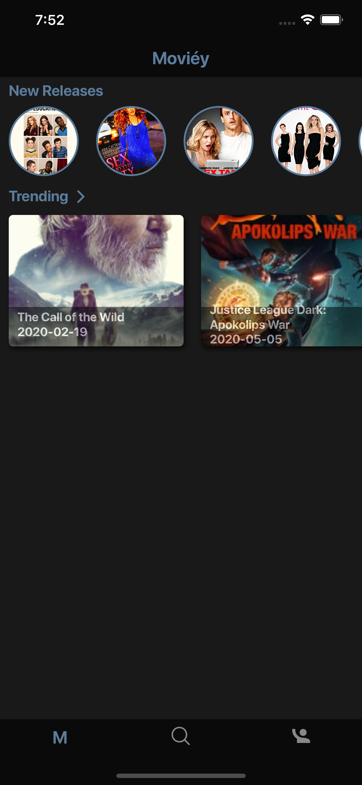
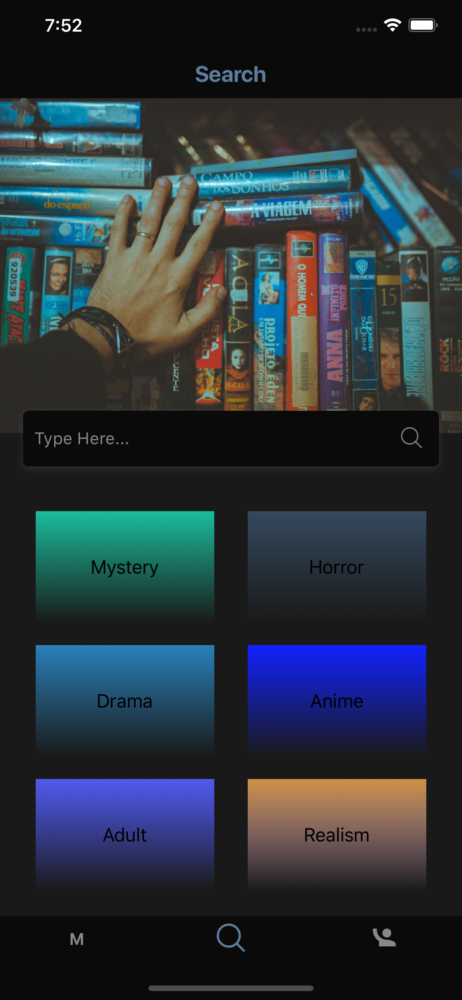
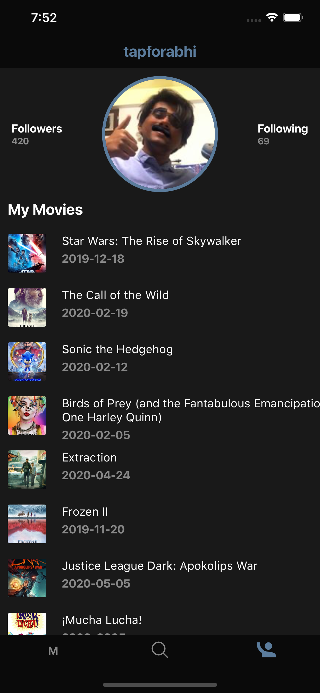
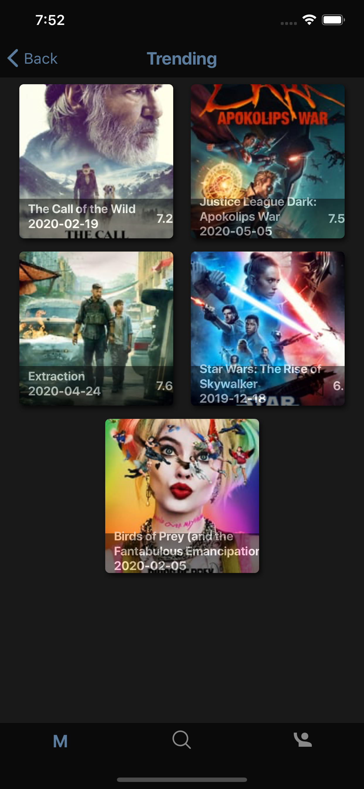
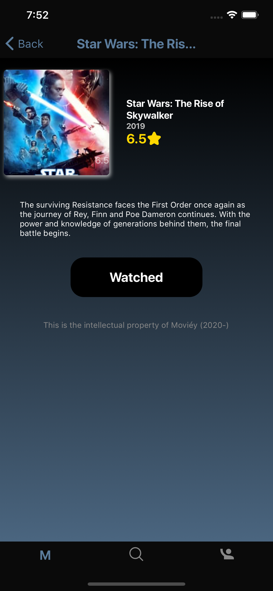

# Moviéy App

<table>
  <tr>
    <td>Home Screen</td>
     <td>Search Screen</td>
     <td>Profile Screen</td>
  </tr>
  <tr>
    <td></td>
    <td></td>
    <td></td>
  </tr>
 </table>
 
 <table>
  <tr>
    <td>Stories</td>
     <td>List of trending movies from the home screen</td>
     <td>Movie Details Screen</td>
  </tr>
  <tr>
    <td></td>
    <td></td>
    <td></td>
  </tr>
 </table>
